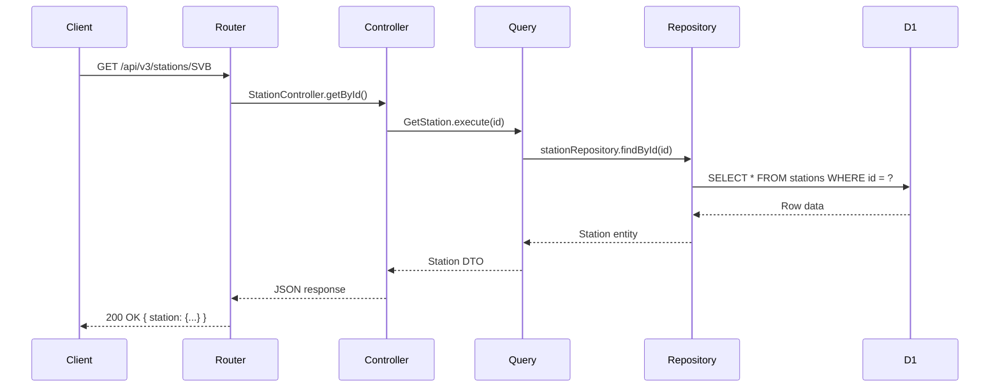
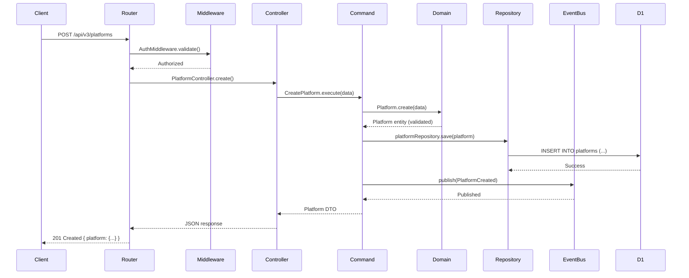
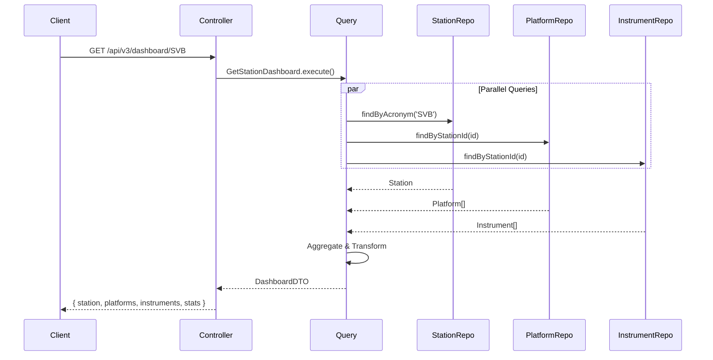

# Architecture Visualization

> **Version**: 13.6.0 (Phase 7.9)
> **Pattern**: Clean Architecture + Hexagonal Architecture

This document provides visual representations of the SITES Spectral Instruments architecture.

---

## 1. Clean Architecture Rings

The architecture follows Uncle Bob's Clean Architecture with four concentric rings:

```
┌─────────────────────────────────────────────────────────────────────────────┐
│                                                                             │
│  ┌───────────────────────────────────────────────────────────────────────┐  │
│  │                                                                       │  │
│  │  ┌─────────────────────────────────────────────────────────────────┐  │  │
│  │  │                                                                 │  │  │
│  │  │  ┌───────────────────────────────────────────────────────────┐  │  │  │
│  │  │  │                                                           │  │  │  │
│  │  │  │                    1. DOMAIN                              │  │  │  │
│  │  │  │                                                           │  │  │  │
│  │  │  │   Entities: Station, Platform, Instrument, ROI            │  │  │  │
│  │  │  │   Value Objects: Polygon, Coordinates, MountTypeCode      │  │  │  │
│  │  │  │   Domain Services: ROIService, CalibrationService         │  │  │  │
│  │  │  │   Repository Ports: StationRepository, PlatformRepository │  │  │  │
│  │  │  │                                                           │  │  │  │
│  │  │  └───────────────────────────────────────────────────────────┘  │  │  │
│  │  │                                                                 │  │  │
│  │  │                    2. APPLICATION                               │  │  │
│  │  │                                                                 │  │  │
│  │  │   Commands: CreateStation, UpdatePlatform, DeleteInstrument    │  │  │
│  │  │   Queries: GetStationDashboard, ListPlatforms, GetCalibration  │  │  │
│  │  │   Use Case Orchestration, Business Rule Enforcement            │  │  │
│  │  │                                                                 │  │  │
│  │  └─────────────────────────────────────────────────────────────────┘  │  │
│  │                                                                       │  │
│  │                    3. INTERFACE ADAPTERS                              │  │
│  │                                                                       │  │
│  │   Controllers: StationController, PlatformController, ROIController   │  │
│  │   Repositories: D1StationRepository, D1PlatformRepository             │  │
│  │   Presenters: JSON response formatting                                │  │
│  │   Middleware: AuthMiddleware, contract-validator                      │  │
│  │                                                                       │  │
│  └───────────────────────────────────────────────────────────────────────┘  │
│                                                                             │
│                    4. FRAMEWORKS & DRIVERS                                  │
│                                                                             │
│   Cloudflare Workers (HTTP runtime)                                         │
│   Cloudflare D1 (SQLite database)                                           │
│   JWT Authentication (jose library)                                         │
│   YAML Configuration (js-yaml)                                              │
│                                                                             │
└─────────────────────────────────────────────────────────────────────────────┘
```

### Dependency Rule

**Dependencies point inward only.** The inner layers know nothing about outer layers.

```
Frameworks → Adapters → Application → Domain
     │            │           │           │
     │            │           │           └─ ZERO external dependencies
     │            │           └─ Depends only on Domain
     │            └─ Depends on Application and Domain
     └─ Depends on everything
```

---

## 2. Hexagonal Architecture (Ports & Adapters)

```
                              DRIVING SIDE (Primary)
                                     │
         ┌───────────────────────────┼───────────────────────────┐
         │                           │                           │
         ▼                           ▼                           ▼
   ┌───────────┐              ┌───────────┐              ┌───────────┐
   │   HTTP    │              │   Admin   │              │   Export  │
   │  Request  │              │  Console  │              │   CLI     │
   └─────┬─────┘              └─────┬─────┘              └─────┬─────┘
         │                           │                           │
         ▼                           ▼                           ▼
   ┌───────────┐              ┌───────────┐              ┌───────────┐
   │  Station  │              │   Admin   │              │  Export   │
   │Controller │              │Controller │              │Controller │
   └─────┬─────┘              └─────┬─────┘              └─────┬─────┘
         │                           │                           │
         └───────────────────────────┼───────────────────────────┘
                                     │
                          ┌──────────┴──────────┐
                          │   INBOUND PORTS     │
                          │   (Use Cases)       │
                          │                     │
                          │  ┌───────────────┐  │
                          │  │   Commands    │  │
                          │  │ CreateStation │  │
                          │  │ UpdatePlatform│  │
                          │  │ DeleteROI     │  │
                          │  └───────────────┘  │
                          │                     │
                          │  ┌───────────────┐  │
                          │  │   Queries     │  │
                          │  │ GetDashboard  │  │
                          │  │ ListPlatforms │  │
                          │  │ GetTimeline   │  │
                          │  └───────────────┘  │
                          └──────────┬──────────┘
                                     │
              ┌──────────────────────┼──────────────────────┐
              │                      │                      │
              │           ┌──────────┴──────────┐           │
              │           │      DOMAIN         │           │
              │           │                     │           │
              │           │  ┌─────────────┐    │           │
              │           │  │  Entities   │    │           │
              │           │  │  Station    │    │           │
              │           │  │  Platform   │    │           │
              │           │  │  Instrument │    │           │
              │           │  └─────────────┘    │           │
              │           │                     │           │
              │           │  ┌─────────────┐    │           │
              │           │  │   Ports     │    │           │
              │           │  │ StationRepo │    │           │
              │           │  │ EventPublish│    │           │
              │           │  │ SecurityPort│    │           │
              │           │  └─────────────┘    │           │
              │           │                     │           │
              │           └──────────┬──────────┘           │
              │                      │                      │
              └──────────────────────┼──────────────────────┘
                                     │
                          ┌──────────┴──────────┐
                          │   OUTBOUND PORTS    │
                          │   (Repository)      │
                          └──────────┬──────────┘
                                     │
         ┌───────────────────────────┼───────────────────────┐
         │                           │                           │
         ▼                           ▼                           ▼
   ┌───────────┐              ┌───────────┐              ┌───────────┐
   │    D1     │              │ InMemory  │              │  NoOp     │
   │ Repository│              │ EventBus  │              │ Metrics   │
   └─────┬─────┘              └─────┬─────┘              └─────┬─────┘
         │                           │                           │
         ▼                           ▼                           ▼
   ┌───────────┐              ┌───────────┐              ┌───────────┐
   │Cloudflare │              │  Memory   │              │  Console  │
   │    D1     │              │  Queue    │              │   Log     │
   └───────────┘              └───────────┘              └───────────┘
         │                           │                           │
         └───────────────────────────┼───────────────────────────┘
                                     │
                              DRIVEN SIDE (Secondary)
```

---

## 3. Component Inventory

### Ring 1: Domain (Core Business Logic)

| Module | Entities | Ports | Services |
|--------|----------|-------|----------|
| **station** | Station | StationRepository | - |
| **platform** | Platform | PlatformRepository | PlatformTypeStrategy |
| **instrument** | Instrument | InstrumentRepository | InstrumentFactory, InstrumentTypeRegistry |
| **roi** | ROI | ROIRepository | ROIService |
| **calibration** | CalibrationRecord | CalibrationRepository | CalibrationService |
| **maintenance** | MaintenanceRecord | MaintenanceRepository | MaintenanceService |
| **campaign** | Campaign | CampaignRepository | CampaignService |
| **product** | Product | ProductRepository | ProductService |
| **aoi** | AOI | AOIRepository | AOIService, GeoJSONParser |
| **analytics** | SystemHealth, SystemOverview | AnalyticsRepository | AnalyticsService |
| **export** | - | ExportRepository | ExportService |
| **user** | - | UserRepositoryV1/V2, UserCredentialsPort | UserService |
| **shared** | - | EventPublisherPort, MetricsPort, SecurityPort | PortVersion, VersionedPortAdapter |

### Ring 2: Application (Use Cases)

| Category | Count | Examples |
|----------|-------|----------|
| **Commands** | 33 | CreateStation, UpdatePlatform, DeleteInstrument, CreateCalibrationRecord |
| **Queries** | 26 | GetStationDashboard, ListPlatforms, GetCalibrationTimeline |
| **Admin Queries** | 3 | GetActivityLogs, GetStationStats, GetUserSessions |
| **Analytics Queries** | 5 | GetSystemHealth, GetSystemOverview, GetStationAnalytics |

### Ring 3: Interface Adapters

| Category | Components |
|----------|------------|
| **Controllers** | StationController, PlatformController, InstrumentController, ROIController, CalibrationController, MaintenanceController, CampaignController, ProductController, AOIController, ExportController, AnalyticsController, AdminController, UserController |
| **Repositories (D1)** | D1StationRepository, D1PlatformRepository, D1InstrumentRepository, D1ROIRepository, D1CalibrationRepository, D1MaintenanceRepository, D1CampaignRepository, D1ProductRepository, D1AOIRepository, D1ExportRepository, D1AnalyticsRepository, D1AdminRepository |
| **Middleware** | AuthMiddleware, contract-validator |
| **Event Adapters** | InMemoryEventBus |
| **Metrics Adapters** | NoOpMetricsAdapter |
| **Auth Adapters** | CloudflareCredentialsAdapter |
| **Logging Adapters** | StructuredConsoleLogger |

### Ring 4: Frameworks & Drivers

| Framework | Purpose |
|-----------|---------|
| **Cloudflare Workers** | HTTP runtime, request handling |
| **Cloudflare D1** | SQLite database, persistence |
| **jose** | JWT token signing/verification |
| **js-yaml / yaml** | Configuration file parsing |

---

## 4. Data Flow Diagrams

### 4.1 Read Operation (Query)



### 4.2 Write Operation (Command)



### 4.3 Dashboard Aggregation



---

## 5. Directory Structure

```
src/
├── domain/                          # Ring 1: Core Business Logic
│   ├── station/
│   │   ├── Station.js               # Entity
│   │   ├── StationRepository.js     # Port (interface)
│   │   └── index.js
│   ├── platform/
│   │   ├── Platform.js              # Entity
│   │   ├── PlatformRepository.js    # Port
│   │   └── types/                   # Strategy pattern
│   │       ├── PlatformTypeStrategy.js
│   │       ├── FixedPlatformType.js
│   │       ├── UAVPlatformType.js
│   │       └── SatellitePlatformType.js
│   ├── instrument/
│   │   ├── Instrument.js            # Entity
│   │   ├── InstrumentRepository.js  # Port
│   │   ├── InstrumentFactory.js     # Factory pattern
│   │   └── InstrumentTypeRegistry.js # Registry pattern
│   ├── shared/
│   │   ├── ports/                   # Cross-cutting ports
│   │   │   ├── EventPublisherPort.js
│   │   │   ├── MetricsPort.js
│   │   │   └── SecurityPort.js
│   │   ├── events/                  # Domain events
│   │   │   ├── DomainEvent.js
│   │   │   └── index.js
│   │   └── versioning/              # Port versioning
│   │       ├── PortVersion.js
│   │       └── VersionedPortAdapter.js
│   └── [other domains...]
│
├── application/                     # Ring 2: Use Cases
│   ├── commands/                    # Write operations
│   │   ├── CreateStation.js
│   │   ├── UpdatePlatform.js
│   │   ├── DeleteInstrument.js
│   │   └── [33 commands total...]
│   ├── queries/                     # Read operations
│   │   ├── GetStation.js
│   │   ├── ListPlatforms.js
│   │   ├── GetStationDashboard.js
│   │   ├── admin/
│   │   │   └── [admin queries...]
│   │   ├── analytics/
│   │   │   └── [analytics queries...]
│   │   └── [26+ queries total...]
│   └── index.js
│
├── infrastructure/                  # Ring 3: Interface Adapters
│   ├── http/
│   │   ├── router.js                # Route definitions
│   │   ├── controllers/             # HTTP adapters
│   │   │   ├── StationController.js
│   │   │   ├── PlatformController.js
│   │   │   └── [13 controllers...]
│   │   └── middleware/
│   │       └── AuthMiddleware.js
│   ├── persistence/
│   │   ├── d1/                      # D1 adapters
│   │   │   ├── D1StationRepository.js
│   │   │   ├── D1PlatformRepository.js
│   │   │   └── [12 repositories...]
│   │   ├── calibration/
│   │   │   └── D1CalibrationRepository.js
│   │   └── maintenance/
│   │       └── D1MaintenanceRepository.js
│   ├── events/
│   │   └── InMemoryEventBus.js
│   ├── metrics/
│   │   └── NoOpMetricsAdapter.js
│   ├── logging/
│   │   └── StructuredConsoleLogger.js
│   └── auth/
│       └── CloudflareCredentialsAdapter.js
│
├── middleware/                      # Ring 4: Framework middleware
│   └── contract-validator.js
│
├── worker.js                        # Ring 4: Cloudflare Workers entry
└── version.js
```

---

## 6. Port-Adapter Mapping

| Port (Domain) | Adapter (Infrastructure) |
|---------------|--------------------------|
| `StationRepository` | `D1StationRepository` |
| `PlatformRepository` | `D1PlatformRepository` |
| `InstrumentRepository` | `D1InstrumentRepository` |
| `ROIRepository` | `D1ROIRepository` |
| `CalibrationRepository` | `D1CalibrationRepository` |
| `MaintenanceRepository` | `D1MaintenanceRepository` |
| `CampaignRepository` | `D1CampaignRepository` |
| `ProductRepository` | `D1ProductRepository` |
| `AOIRepository` | `D1AOIRepository` |
| `ExportRepository` | `D1ExportRepository` |
| `AnalyticsRepository` | `D1AnalyticsRepository` |
| `EventPublisherPort` | `InMemoryEventBus` |
| `MetricsPort` | `NoOpMetricsAdapter` |
| `SecurityPort` | `AuthMiddleware` |
| `UserCredentialsPort` | `CloudflareCredentialsAdapter` |

---

## 7. Platform Type Strategy Pattern

```
                    ┌───────────────────────────┐
                    │  PlatformTypeStrategy     │
                    │  (Abstract Base)          │
                    ├───────────────────────────┤
                    │ + generateNormalizedName()│
                    │ + validate()              │
                    │ + getAutoInstruments()    │
                    └─────────────┬─────────────┘
                                  │
            ┌─────────────────────┼─────────────────────┐
            │                     │                     │
            ▼                     ▼                     ▼
   ┌─────────────────┐   ┌─────────────────┐   ┌─────────────────┐
   │FixedPlatformType│   │ UAVPlatformType │   │SatellitePlatform│
   ├─────────────────┤   ├─────────────────┤   ├─────────────────┤
   │ Towers, masts   │   │ Drones          │   │ Earth obs       │
   │ Buildings       │   │ Auto-instrument │   │ Sentinel, etc   │
   │ Ground level    │   │ creation        │   │                 │
   └─────────────────┘   └─────────────────┘   └─────────────────┘
```

---

## 8. CQRS Pattern

```
                    ┌─────────────────────────────────────────┐
                    │              API Request                │
                    └──────────────────┬──────────────────────┘
                                       │
                    ┌──────────────────┴──────────────────────┐
                    │                                         │
                    ▼                                         ▼
           ┌───────────────┐                         ┌───────────────┐
           │   COMMANDS    │                         │    QUERIES    │
           │  (Write Side) │                         │  (Read Side)  │
           ├───────────────┤                         ├───────────────┤
           │ CreateStation │                         │ GetStation    │
           │ UpdatePlatform│                         │ ListPlatforms │
           │ DeleteROI     │                         │ GetDashboard  │
           └───────┬───────┘                         └───────┬───────┘
                   │                                         │
                   ▼                                         ▼
           ┌───────────────┐                         ┌───────────────┐
           │    Domain     │                         │  Repository   │
           │   Entities    │                         │   Queries     │
           │  (Validation) │                         │ (Optimized)   │
           └───────┬───────┘                         └───────┬───────┘
                   │                                         │
                   ▼                                         ▼
           ┌───────────────┐                         ┌───────────────┐
           │  Repository   │                         │   Database    │
           │    Save       │                         │    Read       │
           └───────┬───────┘                         └───────────────┘
                   │
                   ▼
           ┌───────────────┐
           │ Domain Events │
           │  (Published)  │
           └───────────────┘
```

---

## 9. Key Design Decisions

| Decision | Rationale | ADR |
|----------|-----------|-----|
| Hexagonal Architecture | Testability, flexibility, clear boundaries | ADR-001 |
| CQRS Pattern | Optimize reads separately from writes | ADR-002 |
| Legacy ROI Preservation | L2/L3 data integrity | ADR-003 |
| Domain Events | Audit trail, decoupled side-effects | ADR-004 |
| Security Ports | Swap auth mechanisms without touching domain | ADR-005 |
| OpenAPI Contract-First | Single source of truth for API | ADR-006 |
| Port Versioning | Safe evolution without breaking adapters | ADR-007 |

---

## See Also

- [ADR Index](./adr/README.md)
- [Port Versioning Strategy](./PORT_VERSIONING.md)
- [OpenAPI Specification](./openapi/openapi.yaml)
- [CLAUDE.md](../CLAUDE.md)
