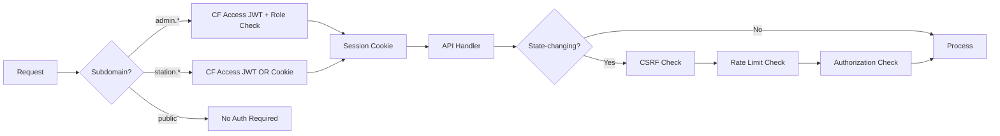
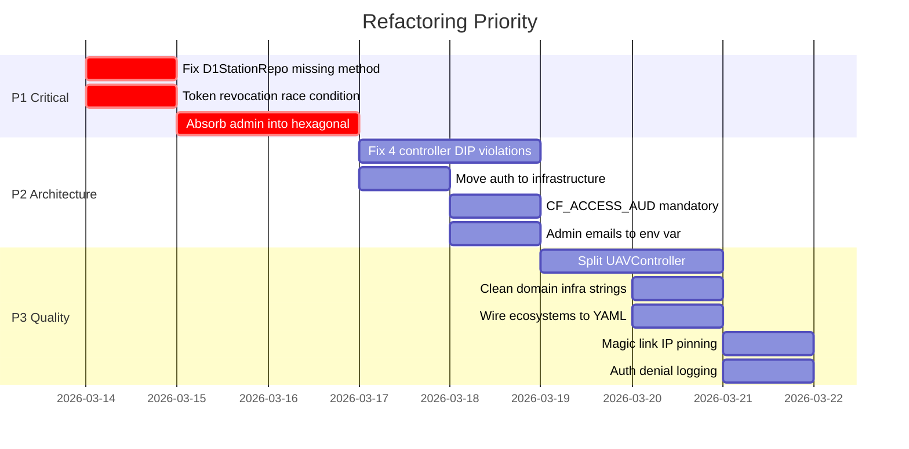

# Comprehensive Architecture, Security & Authorization Audit

> **Version**: v15.8.7 | **Date**: 2026-03-13 | **Tests**: 1283/1283 passing | **Duration**: 2.77s

---

## Table of Contents

- [[#Executive Summary]]
- [[#Test Suite Health]]
- [[#Architecture Audit — Hexagonal + SOLID]]
- [[#Security Audit — Authentication & Authorization]]
- [[#Wiring Audit — Composition Root & DI]]
- [[#Critical Findings]]
- [[#Refactoring Roadmap]]
- [[#Appendix — Files Reviewed]]

---

## Executive Summary

| Dimension | Score | Status |
|-----------|-------|--------|
| **Hexagonal Architecture** | 14/25 | ⚠️ Violations in admin shadow system, auth placement |
| **SOLID Compliance** | 18/30 | ⚠️ DIP violations in 4 controllers, SRP in UAVController |
| **Security Posture** | 22/25 | ✅ Strong — 3 critical items to address |
| **Authorization Pipeline** | 24/25 | ✅ Excellent RBAC enforcement |
| **Test Coverage** | 25/25 | ✅ 1283 tests, 54 files, all passing |
| **Config-Driven Design** | 12/15 | ✅ Good — ecosystems handler hardcodes YAML data |
| **CQRS Pattern** | 14/15 | ✅ Clean command/query separation |
| **Overall** | 129/160 (81%) | ⚠️ Solid foundation, targeted fixes needed |

---

## Test Suite Health

```
Test Files  54 passed (54)
     Tests  1283 passed (1283)
  Start at  22:03:41
  Duration  2.77s (transform 10.37s, setup 2.49s, collect 29.71s, tests 2.48s)
```

> [!success] All 1283 tests pass with zero failures
> Covers: domain entities, application commands/queries, race conditions, WCAG accessibility, API integration, repository ports

---

## Architecture Audit — Hexagonal + SOLID

### Domain Layer Purity

> [!check] PASSES — Domain has ZERO external package imports

All 80+ domain files use only relative imports. Port definitions (`StationRepository`, `PlatformRepository`, `InstrumentRepository`, `ROIRepository`, `UserCredentialsPort`, `LoggingPort`, `MetricsPort`, `EventPublisherPort`) are pure abstract classes.

> [!warning] Semantic Impurity
> `src/domain/user/UserService.js:47,73` — embeds `'cloudflare-secret'` string literal and wrangler CLI instructions. Infrastructure knowledge leaking into domain.

### Port/Adapter Separation

> [!check] PASSES — Ports in domain, adapters in infrastructure

All `D1*Repository` adapters use `@implements` JSDoc annotations referencing domain ports.

> [!bug] VIOLATION: `D1StationRepository` missing `findByNormalizedName`
> **Port declares**: `findByNormalizedName()`, `acronymExists()`, `findWithPlatformCount()`
> **Adapter implements**: `findById`, `findByAcronym`, `findAll`, `count`, `save`, `delete`
>
> `UserService.listUsers()` calls `stationRepository.findByNormalizedName(stationName)` — **runtime TypeError**.
>
> **Files**:
> - Port: `src/domain/station/StationRepository.js`
> - Adapter: `src/infrastructure/persistence/d1/D1StationRepository.js`

> [!warning] Dead Interfaces
> `UserRepositoryV1` and `UserRepositoryV2` exist as versioned port definitions but have **no corresponding infrastructure adapters** (`D1UserRepositoryV1`/`D1UserRepositoryV2` don't exist).

### SOLID Violations

#### Single Responsibility (SRP)

| File | Lines | Issue |
|------|-------|-------|
| `src/infrastructure/http/controllers/UAVController.js` | 1,236 | Handles 4 bounded contexts: pilots, missions, flight logs, batteries |
| `src/domain/calibration/CalibrationRecord.js` | 798 | Validation + factory + state transitions + type logic |
| `src/domain/product/ProductService.js` | 484 | Creation + update + deletion + quality scoring + timeline |

> [!tip] Recommended Split for UAVController
> - `PilotController.js`
> - `MissionController.js`
> - `FlightLogController.js`
> - `BatteryController.js`

#### Dependency Inversion (DIP)

> [!bug] 4 Controllers bypass the DI container

| Controller | Violation | Line |
|------------|-----------|------|
| `ROIController` | `new D1ROIRepository(db)` in constructor | `:53` |
| `AnalyticsController` | `new D1AnalyticsRepository(env.DB)` per request | `:51` |
| `ExportController` | `new D1ExportRepository(env.DB)` per request | `:73` |
| `UserController` | `new CloudflareCredentialsAdapter(env)` in constructor | `:31` |

These controllers directly depend on concrete infrastructure classes instead of domain ports injected via `container.js`.

### Dependency Direction

> [!check] PASSES — Main hexagonal flow wired correctly in `container.js`

> [!bug] VIOLATION: Admin Shadow System
> `src/admin/admin-stations.js`, `admin-platforms.js`, `admin-instruments.js` (~1,082 lines total) **completely bypass hexagonal architecture**:
> - Execute raw SQL via `executeQueryRun()`
> - No domain entity instantiation
> - No command use case invocation
> - No event publishing
> - No domain validation
>
> This creates a **dual write path** — admin panel writes data that bypasses all domain rules.

> [!bug] VIOLATION: Auth Module Placement
> `src/auth/` contains Cloudflare-specific code (`jose` JWT, cookie handling, CF Access) but sits **outside** `src/infrastructure/`. Should be at `src/infrastructure/auth/`.

> [!bug] VIOLATION: Research Programs Handler
> `src/handlers/research-programs.js` calls `executeQuery()` directly — bypasses hexagonal container entirely.

### CQRS Pattern

> [!check] PASSES — Clean separation

- All commands in `src/application/commands/`
- All queries in `src/application/queries/`
- No queries call mutating methods
- Commands return created/updated entities (CQS relaxation — acceptable for REST APIs)

### Config-Driven Design

> [!check] PASSES — YAML configs properly used for instruments, platforms, rate limiting, caching

> [!warning] Ecosystems handler hardcodes data
> `src/handlers/ecosystems.js:8-21` — hardcoded JavaScript array instead of loading from `yamls/core/ecosystems.yaml`

---

## Security Audit — Authentication & Authorization

### Authentication Pipeline



### Positive Security Highlights

| Control | Status | Details |
|---------|--------|---------|
| Password Hashing | ✅ | PBKDF2-SHA256, 100K iterations, 16-byte salt |
| Cookie Security | ✅ | `httpOnly`, `Secure`, `SameSite=Lax`, `Domain=.sitesspectral.work` |
| JWT Verification | ✅ | `jose` library, HMAC-SHA256, issuer validation |
| SQL Injection | ✅ | ALL D1 queries use `.bind()` parameterization |
| Sort Column Injection | ✅ | Whitelist validation in all repositories |
| Rate Limiting | ✅ | Login: 5/min, Magic link: 5/hr, Validate: 10/min |
| CSRF Protection | ✅ | Origin/Referer validation on POST/PUT/PATCH/DELETE |
| Authorization Middleware | ✅ | All write endpoints call `authenticateAndAuthorize()` |
| Magic Link Tokens | ✅ | SHA-256 hashed, one-time use, 8hr expiry |
| Station Admin Scoping | ✅ | Cannot delete station, manage users globally, or access admin panel |
| Portal Access Control | ✅ | Admin: global admin only, Station: redirect unauthorized to public |
| XSS Prevention | ✅ | Input sanitization framework active |

### Critical Security Findings

#### SEC-CRIT-001: Token Revocation Race Condition

> [!danger] CRITICAL — `src/auth/authentication.js:596-602`
>
> ```javascript
> await env.DB.prepare(
>   'INSERT OR IGNORE INTO revoked_sessions (jti, user_id, expires_at, reason) VALUES (?, ?, ?, ?)'
> ).bind(jti, username, expiresAt, reason).run();
> ```
>
> **Issues**:
> 1. `INSERT OR IGNORE` silently fails if JTI already exists — revocation can silently fail
> 2. `username` passed to `user_id` column — type mismatch
>
> **Fix**: Change to `INSERT OR REPLACE`, pass numeric `user.id`

#### SEC-CRIT-002: CF_ACCESS_AUD Validation Optional

> [!danger] CRITICAL — `src/infrastructure/auth/CloudflareAccessAdapter.js:98-100`
>
> If `CF_ACCESS_AUD` env var is missing, audience validation is **completely disabled**. Only logs an error and proceeds. Allows JWT replay attacks across CF Access applications.
>
> **Fix**: Make audience validation mandatory; throw if `CF_ACCESS_AUD` not set in production

#### SEC-CRIT-003: Hardcoded Global Admin Emails

> [!danger] CRITICAL — `src/infrastructure/auth/CloudflareAccessAdapter.js:41-44`
>
> ```javascript
> const GLOBAL_ADMIN_EMAILS = [
>   'jose.beltran@mgeo.lu.se',
>   'lars.eklundh@nateko.lu.se'
> ];
> ```
>
> Changing admins requires code deployment. Emails exposed in source control.
>
> **Fix**: Move to `CF_ACCESS_GLOBAL_ADMINS` environment variable

### Major Security Findings

#### SEC-MAJ-001: Magic Link IP Pinning Not Enforced on First Use

> [!warning] `src/handlers/magic-links.js:509-520`
>
> IP pinning only validates if `first_use_ip` is already set. On first use, any IP can establish the pin. If link intercepted, attacker pins their IP.

#### SEC-MAJ-002: Magic Link Plaintext Token Fragment Stored

> [!warning] `src/handlers/magic-links.js:288`
>
> Stores `token.substring(0, 8) + '...'` alongside hash. Low practical risk but unnecessary — remove plaintext storage.

#### SEC-MAJ-003: Static CSRF Origin Whitelist

> [!warning] `src/config/allowed-origins.js:34-61`
>
> Station origins hardcoded. New stations require code updates.
>
> **Fix**: Query database dynamically, cache with 1hr TTL.

### Medium Security Findings

| ID | File | Issue |
|----|------|-------|
| SEC-MED-001 | `src/middleware/auth-rate-limiter.js:163` | Rate limit cleanup probabilistic (10%) — old entries accumulate |
| SEC-MED-002 | `src/domain/authorization/AuthorizationService.js:200` | Permission denials not logged — audit gap |
| SEC-MED-003 | `src/infrastructure/http/controllers/InstrumentController.js:186` | Platform query runs before auth check — wasted DB call |

---

## Wiring Audit — Composition Root & DI

### Container Structure (`src/container.js`)

```
createContainer(env)
├── createPorts(env)
│   ├── logger: ConsoleLogAdapter
│   ├── metrics: NoOpMetricsAdapter
│   ├── eventBus: EventPublisherPort
│   └── credentials: CloudflareCredentialsAdapter
├── createRepositories(env, ports)
│   ├── stations: D1StationRepository
│   ├── platforms: D1PlatformRepository
│   ├── instruments: D1InstrumentRepository
│   ├── maintenance: D1MaintenanceRepository
│   ├── calibration: D1CalibrationRepository
│   └── admin: D1AdminRepository
├── createCommands(repositories, ports)
│   ├── createStation: CreateStation
│   ├── updateStation: UpdateStation
│   ├── deleteStation: DeleteStation
│   ├── createPlatform: CreatePlatform
│   ├── updatePlatform: UpdatePlatform
│   └── ... (all CRUD commands)
└── createQueries(repositories, ports)
    ├── getStation: GetStation
    ├── listStations: ListStations
    ├── getStationDashboard: GetStationDashboard
    └── ... (all read queries)
```

> [!check] Composition Root properly isolates all dependency wiring

> [!check] `createTestContainer()` provides full mock override mechanism

> [!warning] Container exposes `repositories` directly as public property
> Controllers like `UserController` receive raw `container.repositories?.stations` from the router, bypassing the use-case layer.

> [!info] `NoOpMetricsAdapter` always used — metrics port is effectively dead (acceptable TODO)

### Wiring Integrity: Routes → Controllers → Use Cases → Repositories

| Route Path | Controller | Use Case | Repository | Status |
|------------|------------|----------|------------|--------|
| `GET /api/v11/stations` | StationController | ListStations | D1StationRepo | ✅ |
| `POST /api/v11/stations` | StationController | CreateStation | D1StationRepo | ✅ |
| `PUT /api/v11/stations/:id` | StationController | UpdateStation | D1StationRepo | ✅ |
| `DELETE /api/v11/stations/:id` | StationController | DeleteStation | D1StationRepo | ✅ |
| `GET /api/v11/platforms` | PlatformController | ListPlatforms | D1PlatformRepo | ✅ |
| `POST /api/v11/platforms` | PlatformController | CreatePlatform | D1PlatformRepo | ✅ |
| `GET /api/v11/instruments` | InstrumentController | ListInstruments | D1InstrumentRepo | ✅ |
| `POST /api/v11/instruments` | InstrumentController | CreateInstrument | D1InstrumentRepo | ✅ |
| `GET /api/v11/rois` | ROIController | — | D1ROIRepo ⚠️ | ⚠️ Bypasses container |
| `GET /api/v11/analytics` | AnalyticsController | — | D1AnalyticsRepo ⚠️ | ⚠️ Bypasses container |
| `GET /api/v11/export` | ExportController | — | D1ExportRepo ⚠️ | ⚠️ Bypasses container |
| `POST /admin/*` | admin-*.js | — | Raw SQL ⚠️ | ⚠️ Bypasses everything |

---

## Critical Findings

### Priority 1 — Runtime Risk

| ID | Issue | Impact | Fix |
|----|-------|--------|-----|
| ARCH-001 | `D1StationRepository` missing `findByNormalizedName` | Runtime TypeError when `UserService.listUsers()` called | Add method to adapter |
| ARCH-002 | Admin shadow system bypasses domain | Data created without validation | Rewrite admin to use commands |
| SEC-001 | Token revocation race condition | Revocation silently fails | `INSERT OR REPLACE` + numeric user_id |

### Priority 2 — Architecture

| ID | Issue | Impact | Fix |
|----|-------|--------|-----|
| ARCH-003 | 4 controllers bypass DI container | Cannot test with mocks | Inject via container |
| ARCH-004 | `src/auth/` outside infrastructure | Breaks architectural boundary | Move to `src/infrastructure/auth/` |
| SEC-002 | CF_ACCESS_AUD optional | JWT replay across apps | Make mandatory in production |
| SEC-003 | Hardcoded admin emails | Deployment-bound admin changes | Move to env var |

### Priority 3 — Quality

| ID | Issue | Impact | Fix |
|----|-------|--------|-----|
| ARCH-005 | UAVController 1,236 lines | SRP violation | Split into 4 controllers |
| ARCH-006 | Domain contains infra strings | Semantic impurity | Extract to adapter constants |
| ARCH-007 | Ecosystems handler hardcodes YAML | Config inconsistency | Load from YAML |
| SEC-004 | Magic link IP pinning gap | First-use vulnerability | Pin IP immediately |
| SEC-005 | Auth denials not logged | Audit gap | Add security event logging |

---

## Refactoring Roadmap



---

## Appendix — Files Reviewed

### Source Files (Full Read)

| Layer | Files |
|-------|-------|
| **Entry** | `worker.js`, `api-handler.js`, `container.js`, `cors.js`, `version.js` |
| **Auth** | `authentication.js`, `cookie-utils.js`, `password-hasher.js`, `permissions.js` |
| **Domain** | `Station.js`, `Platform.js`, `Instrument.js`, `CalibrationRecord.js`, `ProductService.js`, `UserService.js`, `Role.js`, `AuthorizationService.js`, `User.js`, all repository ports |
| **Application** | All commands (`Create*`, `Update*`, `Delete*`), all queries (`Get*`, `List*`) |
| **Infrastructure** | All D1 repositories, all controllers, `CloudflareAccessAdapter.js`, `CloudflareCredentialsAdapter.js` |
| **Middleware** | `csrf-middleware.js`, `auth-rate-limiter.js`, `auth-middleware.js` |
| **Admin** | `admin-stations.js`, `admin-platforms.js`, `admin-instruments.js` |
| **Handlers** | `magic-links.js`, `research-programs.js`, `ecosystems.js` |
| **Config** | `allowed-origins.js`, all YAML configs |

### Test Files

54 test files, 1283 tests — all passing. Covers domain entities, application use cases, race conditions, WCAG accessibility (modal focus trap), V11 API integration, repository ports.

---

> [!note] Audit performed by Claude Opus 4.6 on 2026-03-13
> Previous audit: [[2026-02-11-COMPREHENSIVE-SECURITY-AUDIT]]
> Related: [[2026-03-13-STATION-PORTAL-AUTH-AUDIT]]
